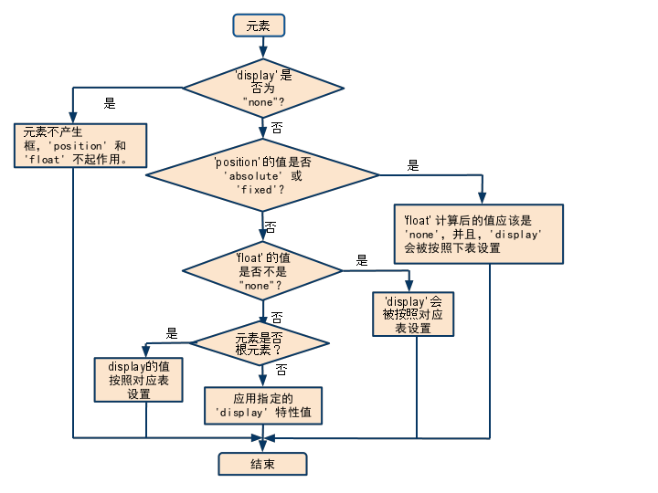

[^_^]:
    参考资料
[^_^]: 
    https://leohxj.gitbooks.io/front-end-database/html-and-css-basic/learn-dom-tree.html    

# 理解DOM结构
DOM: Document Object Module, 文档对象模型。我们通过JavaScript操作页面的元素，进行添加、移动、改变或移除的方法和属性, 都是DOM提供的。

## W3C DOM 标准
被分为 3 个不同的部分:
- 核心 DOM - 针对任何结构化文档的标准模型
- XML DOM - 针对 XML 文档的标准模型
- HTML DOM - 针对 HTML 文档的标准模型

## DOM节点
根据 W3C 的 HTML DOM 标准，HTML 文档中的所有内容都是节点：
- 整个文档是一个文档节点
- 每个 HTML 元素是元素节点
- HTML 元素内的文本是文本节点
- 每个 HTML 属性是属性节点
- 注释是注释节点

## HTML DOM 节点树
HTML文本会被解析为DOM树, 树中的所有节点均可通过 JavaScript 进行访问。所有 HTML 元素（节点）均可被修改，也可以创建或删除节点。


## 节点的关系
父（parent）、子（child）和同胞（sibling）等术语用于描述这些关系。父节点拥有子节点。同级的子节点被称为同胞（兄弟或姐妹）:
- 在节点树中，顶端节点被称为根（root）
- 每个节点都有父节点、除了根（它没有父节点）
- 一个节点可拥有任意数量的子
- 同胞是拥有相同父节点的节点


# 盒模型
见图： 


## 各种元素匡高计算如下：
### content-box（默认）
布局所占宽度Width：
```
Width = width + padding-left + padding-right + border-left + border-right
```

布局所占高度Height:
```
Height = height + padding-top + padding-bottom + border-top + border-bottom
```

### padding-box
布局所占宽度Width：
```
Width = width(包含padding-left + padding-right) + border-left + border-right
```

布局所占高度Height:
```
Height = height(包含padding-top + padding-bottom) + border-top + border-bottom
```

### border-box
布局所占宽度Width：
```
Width = width(包含padding-left + padding-right + border-left + border-right)
```

布局所占高度Height:
```
Height = height(包含padding-top + padding-bottom + border-top + border-bottom)
```
## margin叠加
外边距叠加是一个相当简单的概念。 但是，在实践中对网页进行布局时， 它会造成许多混淆。 简单的说， 当两个或更多个垂直边距相遇时， 它们将形成一个外边距。这个外边距的高度等于两个发生叠加的外边距的高度中的较大者。但是注意只有普通文档流中块框的垂直外边距才会发生外边距叠加。 行内框、 浮动框或绝对定位框之间的外边距不会叠加。

一般来说， 垂直外边距叠加有三种情况：

- 元素自身叠加 当元素没有内容（即空元素）、内边距、边框时， 它的上下边距就相遇了， 即会产生叠加（垂直方向）。 当为元素添加内容、 内边距、 边框任何一项， 就会取消叠加。
- 相邻元素叠加 相邻的两个元素， 如果它们的上下边距相遇，即会产生叠加。
- 包含（父子）元素叠加 包含元素的外边距隔着 父元素的内边距和边框， 当这两项都不存在的时候， 父子元素垂直外边距相邻， 产生叠加。 添加任何一项即会取消叠加。

# 'display', 'position', and 'float'三者对布局的影响
